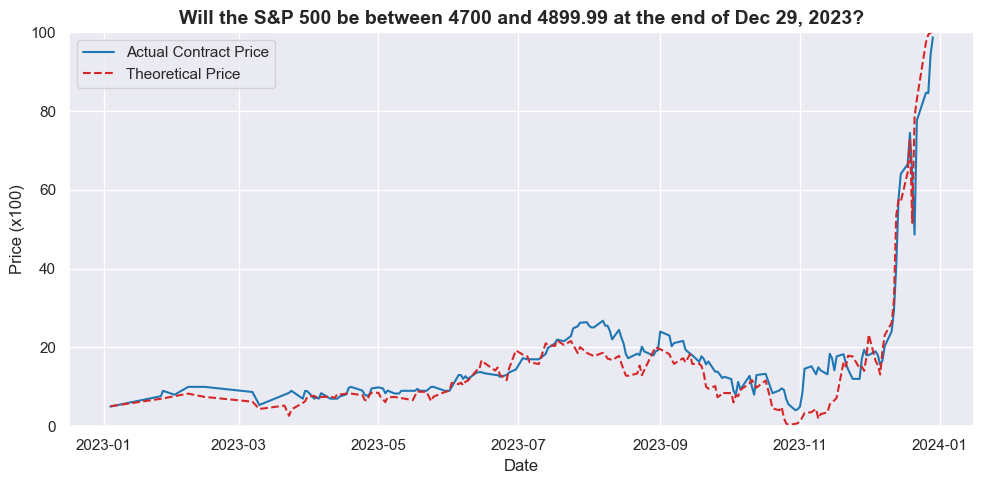

# Kalshi Binary Option Pricing



This repository contains code and data for analyzing and pricing binary options on the SP500 closing price Kalshi.

## Directory Structure

```
.
├── data/                     # Data directory containing CSV files
│   ├── sp500.csv             # S&P 500 historical data
│   ├── r.csv                 # Risk-free rate data
│   └── kalshi_trades.csv     # Historical Kalshi trading data
│
├── kalshi.ipynb              # Main analysis notebook for Kalshi data
├── exploration.ipynb         # Initial data exploration notebook
├── sp500.ipynb              # S&P 500 analysis notebook
│
├── KalshiClientsBaseV2ApiKey.py  # Kalshi API client implementation
├── LICENSE                   # Project license file
└── .gitignore               # Git ignore rules
```

## File Descriptions

- **Notebooks**:
  - `kalshi.ipynb`: Analysis of Kalshi data
  - `sp500.ipynb`: Analysis of S&P 500 data 
  - `exploration.ipynb`: Data exploration and analysis of the relationship between Kalshi Option Prices and the S&P500 underlying  

- **Data Files**:
  - `sp500.csv`: Historical S&P 500 price data
  - `r.csv`: Risk-free rate data for pricing calculations
  - `kalshi_trades.csv`: Historical trading data from Kalshi platform

- **API Client**:
  - `KalshiClientsBaseV2ApiKey.py`: Implementation of the Kalshi API client for data retrieval

## Getting Started

1. Ensure you have Python installed with Jupyter notebook support
2. Place your Kalshi API key in the appropriate location
3. Open the notebooks in Jupyter to begin analysis
